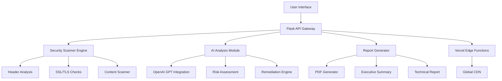

# 🛡️ AutoPent.AI

<div align="center">

**AI-Powered Security Scanner with Professional Reporting**

[](https://vercel.com)
[](https://python.org)
[](https://flask.palletsprojects.com)
[](https://openai.com)
[](LICENSE)

_Transform URL security scanning with intelligent AI analysis and professional reporting_

[🚀 Live Demo](https://auto-pent-ai.vercel.app) • [📖 Documentation](#documentation) • [🔧 Installation](#installation) • [🌐 Deploy](#deployment)

</div>

---

## 📋 Table of Contents

- [🎯 Overview](#-overview)
- [✨ Features](#-features)
- [🏗️ Architecture](#️-architecture)
- [🚀 Quick Start](#-quick-start)
- [🔧 Installation](#-installation)
- [🌐 Deployment](#-deployment)
- [📚 API Documentation](#-api-documentation)
- [🎛️ Configuration](#️-configuration)
- [🤝 Contributing](#-contributing)
- [📄 License](#-license)

---

## 🎯 Overview

**AutoPent.AI** is a cutting-edge security assessment platform that combines automated vulnerability scanning with AI-powered analysis. It provides security professionals and developers with comprehensive security reports that are both technically accurate and business-friendly.

### 🎪 What Makes It Special?

- **🧠 AI-Powered Analysis**: Leverages OpenAI GPT models for intelligent vulnerability assessment
- **📊 Professional Reports**: Generates publication-ready PDF reports with executive summaries
- **⚡ Serverless Architecture**: Built for scalability with Vercel's edge functions
- **🎯 Zero Configuration**: Works out-of-the-box with minimal setup
- **🔒 Privacy-First**: No data storage - scan results are temporary and secure

---

## ✨ Features

### 🔍 **Comprehensive Security Scanning**

- **HTTP Security Headers Analysis** - Detects missing security headers (CSP, HSTS, X-Frame-Options)
- **SSL/TLS Configuration Assessment** - Validates certificate security and protocol versions
- **Content Security Analysis** - Identifies potential XSS vectors and inline scripts
- **Information Disclosure Detection** - Finds exposed server information and debug data

### 🤖 **AI-Enhanced Intelligence**

- **Risk Prioritization** - AI-powered vulnerability severity assessment
- **Fix Recommendations** - Detailed, actionable remediation guidance
- **Business Impact Analysis** - Translates technical findings into business risks
- **Contextual Insights** - Industry-specific security recommendations

### 📄 **Professional Reporting**

- **Executive Summaries** - Board-ready risk assessments
- **Technical Details** - Comprehensive vulnerability breakdowns
- **Visual Risk Metrics** - Charts and graphs for quick understanding
- **Compliance Mapping** - OWASP Top 10 and industry standard alignment

### 🚀 **Modern Architecture**

- **Real-time Scanning** - Live progress updates with WebSocket-like experience
- **Responsive Design** - Mobile-friendly interface for on-the-go assessments
- **API-First Design** - RESTful APIs for integration with existing workflows
- **Serverless Deployment** - Automatic scaling and global edge distribution

---

## 🏗️ Architecture



### Tech Stack

| Layer          | Technology                     | Purpose                     |
| -------------- | ------------------------------ | --------------------------- |
| **Frontend**   | Vanilla JavaScript, Modern CSS | Responsive, fast UI         |
| **Backend**    | Flask, Python 3.12             | RESTful API services        |
| **AI Engine**  | OpenAI GPT-4                   | Intelligent analysis        |
| **Reports**    | ReportLab                      | Professional PDF generation |
| **Security**   | Custom Scanner Engine          | Vulnerability detection     |
| **Deployment** | Vercel, Serverless Functions   | Global edge distribution    |

---

## 🚀 Quick Start

### 1. **One-Click Deploy**

[](https://vercel.com/new/clone?repository-url=https://github.com/your-username/AutoPent.AI&env=OPENAI_API_KEY&envDescription=OpenAI%20API%20key%20for%20AI%20analysis&envLink=https://platform.openai.com/api-keys)

### 2. **Local Development**

```bash
# Clone the repository
git clone https://github.com/your-username/AutoPent.AI.git
cd AutoPent.AI

# Install dependencies
pip install -r requirements.txt

# Configure environment (optional)
cp env.example .env
# Edit .env with your OpenAI API key

# Run the application
python run_web.py
```

🌐 **Access at**: `http://localhost:5000`

### 3. **Docker Deployment**

```bash
# Build and run with Docker
docker build -t autopent-ai .
docker run -p 5000:5000 -e OPENAI_API_KEY=your_key autopent-ai
```

---

## 🔧 Installation

### Prerequisites

- **Python 3.12+** (3.9+ supported with legacy build)
- **Node.js 20.x or 22.x** (for Vercel deployment)
- **OpenAI API Key** (optional, for AI features)

### Local Setup

1. **Clone and Install**

   ```bash
   git clone https://github.com/your-username/AutoPent.AI.git
   cd AutoPent.AI
   pip install -r requirements.txt
   ```

2. **Environment Configuration**

   ```bash
   cp env.example .env
   ```

   Edit `.env`:

   ```env
   OPENAI_API_KEY=sk-your-openai-api-key-here
   FLASK_ENV=development
   ```

3. **Run Application**
   ```bash
   python run_web.py
   ```

### Development Mode

```bash
# Run with auto-reload
python -m api.main

# Run tests
python -m pytest tests/

# Format code
black . && isort .
```

---

## 🌐 Deployment

### Vercel (Recommended)

1. **Connect Repository**

   - Fork this repository
   - Connect to Vercel Dashboard
   - Import your fork

2. **Environment Variables**

   ```
   OPENAI_API_KEY=your_openai_api_key_here
   PYTHONPATH=.
   ```

3. **Deploy**
   - Push to main branch
   - Automatic deployment via GitHub integration

### Alternative Platforms

<details>
<summary>Railway Deployment</summary>

```bash
# Install Railway CLI
npm install -g @railway/cli

# Login and deploy
railway login
railway init
railway up
```

</details>

<details>
<summary>Heroku Deployment</summary>

```bash
# Install Heroku CLI and deploy
heroku create your-app-name
heroku config:set OPENAI_API_KEY=your_key
git push heroku main
```

</details>

<details>
<summary>AWS Lambda</summary>

```bash
# Use Serverless Framework
npm install -g serverless
serverless deploy
```

</details>

---

## 📚 API Documentation

### Base URL

```
Production: https://your-app.vercel.app/api
Local: http://localhost:5000/api
```

### Endpoints

#### **Health Check**

```http
GET /api/health
```

**Response:**

```json
{
  "status": "healthy",
  "timestamp": "2025-01-25T10:30:00Z",
  "version": "1.0.0",
  "environment": "production",
  "features": {
    "ai_analysis": true,
    "pdf_reports": true,
    "security_scanning": true
  }
}
```

#### **Start Security Scan**

```http
POST /api/scan
Content-Type: application/json
```

**Request:**

```json
{
  "target_url": "https://example.com",
  "include_ai": true
}
```

**Response:**

```json
{
  "status": "success",
  "scan_id": "20250125_103000",
  "target_url": "https://example.com",
  "results": {
    "metadata": { "target_url": "https://example.com" },
    "summary": {
      "total_alerts": 5,
      "risk_counts": {
        "High": 1,
        "Medium": 2,
        "Low": 2
      }
    },
    "alerts": [...],
    "statistics": {...}
  },
  "ai_enabled": true,
  "ai_analyses_count": 5
}
```

#### **Download Report**

```http
GET /api/download-report/{scan_id}
```

**Response:** PDF file download

#### **Configuration**

```http
GET /api/config
```

**Response:**

```json
{
  "ai_enabled": true,
  "max_scan_targets": 1,
  "supported_protocols": ["http", "https"],
  "features": {
    "security_headers": true,
    "ssl_analysis": true,
    "ai_analysis": true,
    "pdf_reports": true
  }
}
```

### Response Codes

| Code  | Description                        |
| ----- | ---------------------------------- |
| `200` | Success                            |
| `400` | Bad Request - Invalid parameters   |
| `404` | Not Found - Resource doesn't exist |
| `500` | Internal Server Error              |

---

## 🎛️ Configuration

### Environment Variables

| Variable         | Required | Default      | Description                    |
| ---------------- | -------- | ------------ | ------------------------------ |
| `OPENAI_API_KEY` | No       | `""`         | OpenAI API key for AI analysis |
| `FLASK_ENV`      | No       | `production` | Flask environment mode         |
| `PYTHONPATH`     | No       | `"."`        | Python module search path      |

### Feature Toggles

```python
# In config.py
class Config:
    # AI Features
    OPENAI_MODEL = "gpt-4"  # or "gpt-3.5-turbo"
    OPENAI_MAX_TOKENS = 1500
    OPENAI_TEMPERATURE = 0.3

    # Scanning Configuration
    MAX_SCAN_DEPTH = 5
    SCAN_TIMEOUT = 30  # seconds

    # Report Configuration
    REPORT_TITLE = "Security Assessment Report"
    REPORT_AUTHOR = "AutoPent.AI"
```

### Advanced Configuration

<details>
<summary>Custom Scanner Settings</summary>

```python
# Custom timeout and user agent
scanner_config = {
    "timeout": 10,
    "user_agent": "AutoPent.AI Security Scanner",
    "follow_redirects": True,
    "verify_ssl": False  # For testing
}
```

</details>

<details>
<summary>AI Model Customization</summary>

```python
# Custom AI prompts and models
ai_config = {
    "model": "gpt-4",
    "temperature": 0.3,
    "max_tokens": 2000,
    "custom_prompts": {
        "vulnerability_analysis": "Custom prompt here..."
    }
}
```

</details>

---

## 🤝 Contributing

We welcome contributions! Please see our [Contributing Guidelines](CONTRIBUTING.md) for details.

### Quick Contribution Guide

1. **Fork the repository**
2. **Create a feature branch**
   ```bash
   git checkout -b feature/amazing-feature
   ```
3. **Make your changes**
4. **Add tests**
   ```bash
   python -m pytest tests/
   ```
5. **Commit your changes**
   ```bash
   git commit -m "Add amazing feature"
   ```
6. **Push to the branch**
   ```bash
   git push origin feature/amazing-feature
   ```
7. **Open a Pull Request**

### Development Setup

```bash
# Install development dependencies
pip install -r requirements-dev.txt

# Install pre-commit hooks
pre-commit install

# Run linting
flake8 . && black . && isort .

# Run security checks
bandit -r .
```

### Code Style

- **Python**: PEP 8 compliance with Black formatting
- **JavaScript**: ESLint with Airbnb configuration
- **Commits**: Conventional Commits specification
- **Documentation**: Google-style docstrings

---

## 🔒 Security

### Responsible Disclosure

If you discover a security vulnerability, please send an email to security@autopent-ai.com. All security vulnerabilities will be promptly addressed.

### Security Features

- **Input Validation**: All user inputs are validated and sanitized
- **Rate Limiting**: API endpoints are protected against abuse
- **Secure Headers**: Security headers are implemented by default
- **No Data Persistence**: Scan results are not stored permanently

---

## 📊 Performance

### Benchmarks

| Metric                | Value         | Notes                           |
| --------------------- | ------------- | ------------------------------- |
| **Scan Time**         | 5-15 seconds  | Depends on target response time |
| **AI Analysis**       | 10-30 seconds | Per vulnerability               |
| **Report Generation** | 2-5 seconds   | PDF creation time               |
| **Memory Usage**      | <512MB        | Peak during scan                |

### Optimization Features

- **Serverless Cold Start**: <2 seconds
- **Edge Caching**: Static assets cached globally
- **Concurrent Scanning**: Multiple vulnerability checks in parallel
- **Optimized AI Calls**: Batch processing for efficiency

---

## 🎨 Roadmap

### Upcoming Features

- [ ] **Multi-target Scanning** - Scan multiple URLs simultaneously
- [ ] **Custom Rules Engine** - User-defined security rules
- [ ] **Integration APIs** - Slack, Teams, and webhook notifications
- [ ] **Historical Tracking** - Trend analysis and improvement tracking
- [ ] **Team Collaboration** - Multi-user workspaces
- [ ] **Custom Branding** - White-label reporting options

### Version History

- **v1.0.0** - Initial release with core scanning features
- **v1.1.0** - Added AI analysis and enhanced reporting
- **v1.2.0** - Vercel deployment optimization and performance improvements

---

## 📄 License

This project is licensed under the MIT License - see the [LICENSE](LICENSE) file for details.

---

## 🙏 Acknowledgments

- **OpenAI** for providing the AI analysis capabilities
- **Vercel** for the exceptional serverless platform
- **Flask** community for the robust web framework
- **ReportLab** for professional PDF generation
- **Security Community** for vulnerability research and best practices

---

## 📞 Support

### Getting Help

- **📖 Documentation**: [View Docs](https://docs.autopent-ai.com)
- **💬 Community**: [Join Discord](https://discord.gg/autopent-ai)
- **🐛 Bug Reports**: [GitHub Issues](https://github.com/your-username/AutoPent.AI/issues)
- **✉️ Email**: support@autopent-ai.com

### Enterprise Support

For enterprise features, custom integrations, or priority support, contact us at enterprise@autopent-ai.com.

---

<div align="center">

**Made with ❤️ for the security community**

[⭐ Star us on GitHub](https://github.com/your-username/AutoPent.AI) • [🐦 Follow on Twitter](https://twitter.com/autopent_ai) • [💼 LinkedIn](https://linkedin.com/company/autopent-ai)

</div>
